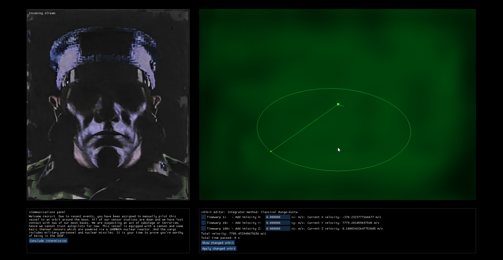
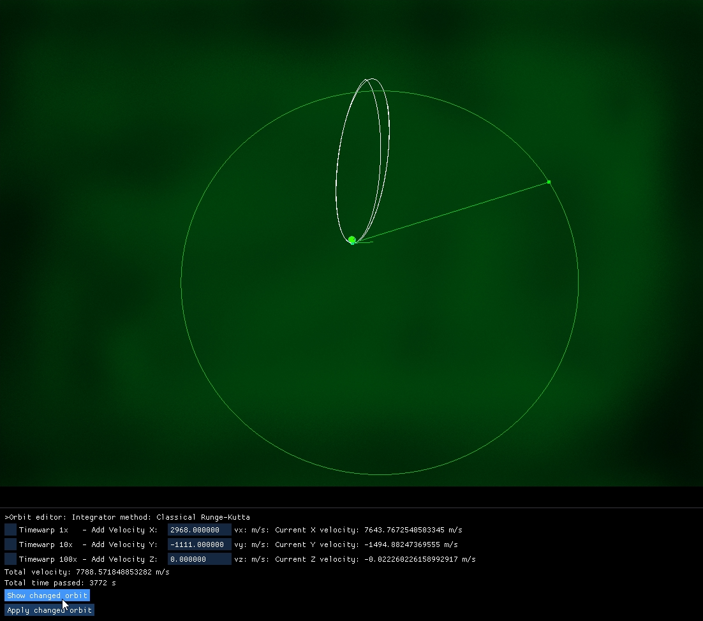
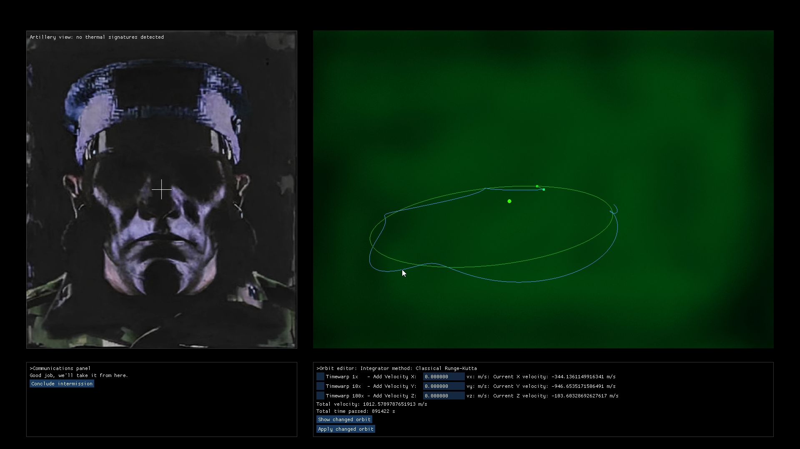

A small java game project using LWJGL libraries. ImGui library was used for the interactable UI, which is rendered on top of a window made with OpenGL. OpenGL handles the orbit rendering and some other stuff.

